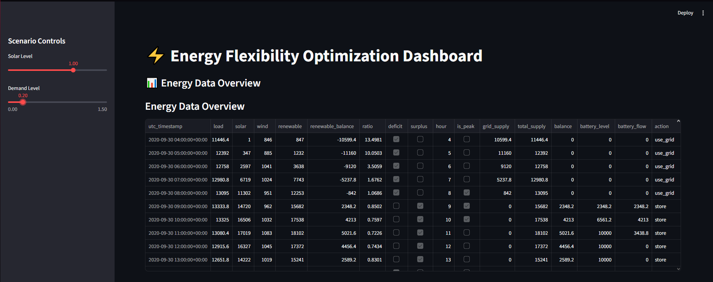
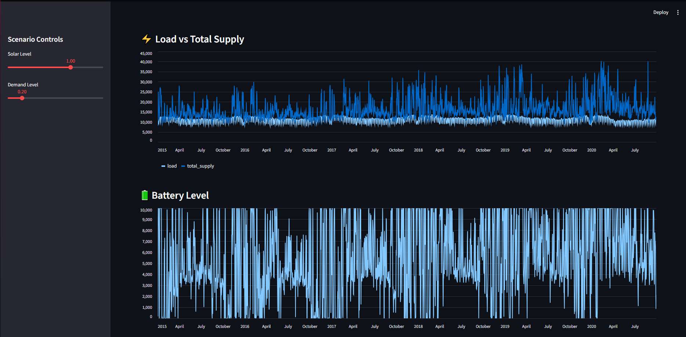
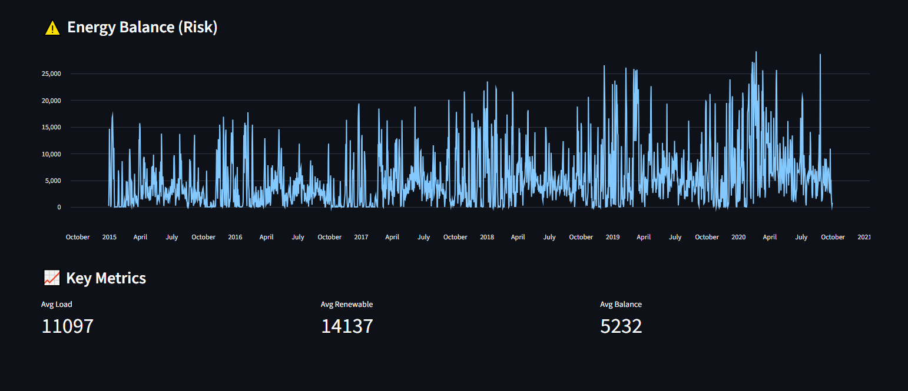

# ⚡ WattWise — Energy Flexibility Optimization System


---


## 📌 Overview

WattWise is a data-driven energy system simulation that models how modern power grids balance electricity demand with renewable generation, storage, and backup supply.

The system uses real-world energy data to analyze demand patterns, evaluate renewable variability, and simulate intelligent energy management decisions.

This project reflects real challenges faced by companies like Siemens Energy in managing renewable-heavy grids.

---

## 🧠 System Architecture


Raw Data → Data Loader → Feature Engineering → Optimization Engine → Simulation → Dashboard

---

## 📸 Dashboard Preview






---

## 🎯 Objectives

* Analyze electricity demand and renewable generation
* Detect patterns in energy usage and production
* Quantify system risk (energy deficit)
* Simulate decision-making for energy storage and grid usage
* Evaluate system performance under different scenarios

---

## 🧱 Project Structure

```
WATTWISE/
│── data/
│── notebooks/
│── src/
│   ├── data_loader.py
│   ├── analysis.py
│   ├── feature_engineering.py
│   ├── optimization.py
│   ├── simulation.py
│── app.py
│── outputs/
│── requirements.txt
│── README.md
```

### Why this structure?

* **src/** → modular, production-ready code
* **data/** → raw datasets separated from logic
* **analysis.py** → exploratory analysis
* **optimization.py** → core decision system
* **simulation.py** → scenario testing
* **app.py** → interactive dashboard

---

## 📊 Data Source

* Open Power System Data (Germany electricity dataset)
* Includes:

  * Load (electricity demand)
  * Solar generation
  * Wind generation

---

## 🔍 Key Features

### 1. Data Analysis

* Time series visualization
* Daily and seasonal patterns
* Correlation analysis
* Risk detection (load vs renewable gap)

### 2. Feature Engineering 

* Renewable supply calculation
* Demand/supply ratio
* Deficit & surplus detection
* Peak hour identification

---

### 3. Optimization System (Core) 

Simulates real-world grid decision-making:

#### ⚡ Energy Priority Logic

1. Use renewable energy
2. Store excess energy in battery
3. Use battery during deficits
4. Use grid backup when needed
5. Mark unmet demand as **"unserved"**

#### 🔋 Battery Model

* Capacity-limited storage
* Charging during surplus
* Discharging during deficit

#### 🔌 Grid Model

* Backup energy with capacity constraint
* Activated only when needed

---

### 4. Scenario Simulation 

Simulates different grid conditions:

* Normal conditions
* Low solar generation (cloudy days)
* High demand (peak stress)

---

### 5. Interactive Dashboard 

Built with Streamlit:

* Adjustable solar and demand levels
* Real-time system response
* Visualizations:

  * Load vs supply
  * Battery level
  * System balance (risk)

---

## ⚡ Key Insights

### 🔥 1. Renewable Energy Alone Is Insufficient

Renewable generation rarely meets total demand → grid backup is essential.

---

### 🔋 2. Storage Depends on Surplus

Battery only charges when:

```
total_supply > demand
```

No surplus → no storage → reduced flexibility.

---

### ⚠️ 3. High Demand Creates System Stress

During peak demand:

* battery drains quickly
* grid usage increases
* risk of unmet demand rises

---

### 🌬️ 4. Wind Dominates Solar Impact

Solar variability has limited effect compared to wind in this dataset.

---

### ⚡ 5. Energy Balance Is Dynamic

Final system balance depends on:

* renewable production
* storage availability
* grid capacity

---

## ⚠️ Limitations

* No forecasting (reactive system only)
* Simplified battery model (no efficiency losses)
* No economic optimization (cost not considered)
* Single-region system (Germany only)
* Grid modeled as rule-based, not optimized

---

## 🚀 Future Improvements

* Add demand and renewable forecasting (ML models)
* Introduce cost optimization (energy pricing)
* Improve battery modeling (efficiency, degradation)
* Multi-region grid simulation
* Reinforcement learning for decision-making

---

## 💼 Real-World Relevance

This project simulates core challenges in modern power systems:

* renewable intermittency
* demand variability
* energy storage management
* grid balancing

Similar systems are used in:

* smart grids
* energy trading platforms
* grid stability optimization

---

## 🛠️ Technologies Used

* Python
* pandas, numpy
* matplotlib, seaborn
* Streamlit

---

## 👨‍💻 Author

Makek Khalifa
